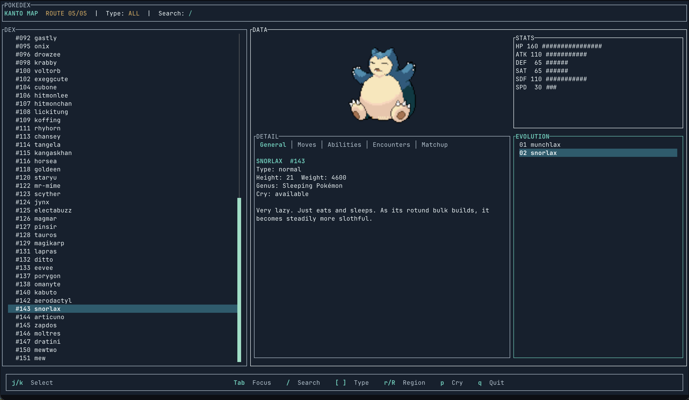

# TUI Stuff

Random TUI projects, probably built with [tui-dispatch](https://github.com/dmk/tui-dispatch).

> **Note:** These are creative sketches only, not ready for use.

## Projects

### [pokeapi](./pokeapi)
Browse Pokemon info using [PokeAPI](https://pokeapi.co/)

### [poketui](./poketui)
Actual Pokemon game in the terminal

### [dndtui](./dndtui)
D&D terminal interface with LLM-powered dungeon master

### [lightline](./lightline)
Dungeon exit game with limited light

