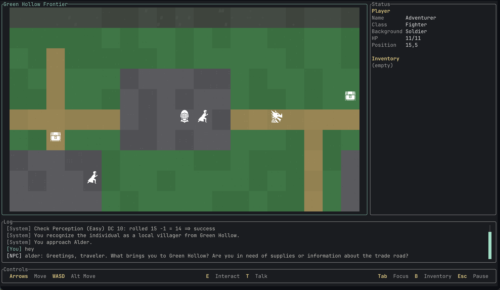

# DnD TUI

A D&D terminal interface with map visualization, custom scenarios, and LLM-powered dungeon master.

_This is a creative sketch only, not ready for use._

---

## Features

- Interactive map display
- Custom scenario support
- LLM integration (OpenAI API / Ollama) serving as DM
- Turn-based gameplay
